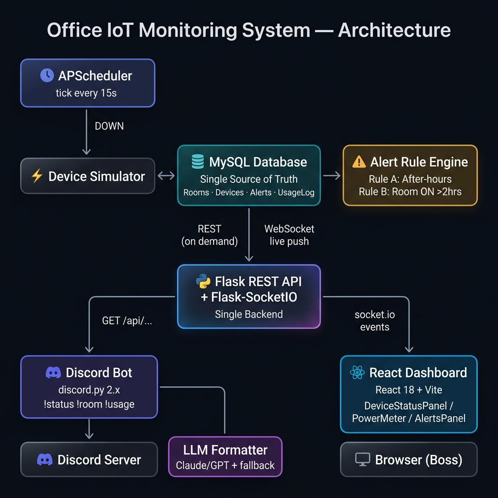
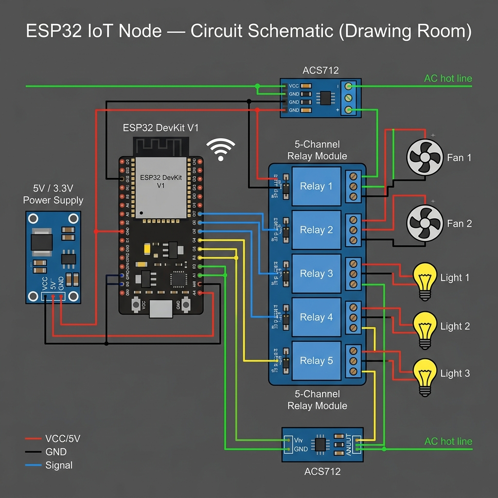
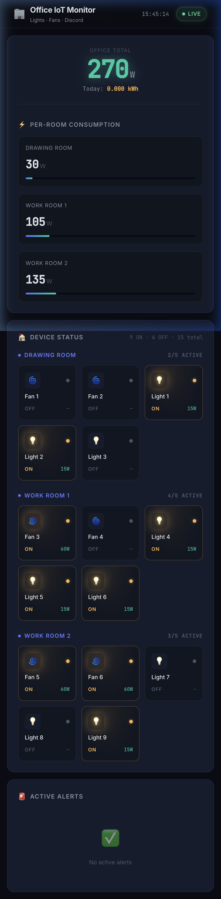

# 🏢 Office IoT Monitoring System
**"Lights, Fans, Discord" — Techathon Nationals & Rover Summit**

A simulation-based office IoT monitoring system that tracks lights and fans across 3 rooms, surfaces live data on a web dashboard, and answers queries via a Discord bot.

---

## System Overview

```
Device Simulator (APScheduler)
        │
        ▼
   MySQL Database  ◄──► Alert Rule Engine
        │
        ▼
 Flask REST API + Flask-SocketIO
    ┌───┴────────────┐
    ▼                ▼
Discord Bot     Web Dashboard
(discord.py)    (React + Vite)
```

- **15 devices**: 2 fans + 3 lights across 3 rooms (Drawing Room, Work Room 1, Work Room 2)
- **Simulator** toggles devices every 10–30s and logs usage every 5 min
- **Alert rules**: after-hours devices (outside 9 AM–5 PM) + room on > 2 hrs continuously
- **Dashboard** updates live via WebSocket — no page refresh needed
- **Discord bot** answers `!status`, `!room <name>`, `!usage` from real backend data

---

## Prerequisites

- Python 3.10+
- Node.js 18+
- MySQL 8.x (running locally or hosted)
- A Discord bot token ([Discord Developer Portal](https://discord.com/developers/applications))

---

## 1. Backend Setup (Flask + MySQL)

```bash
cd backend
python -m venv venv
source venv/bin/activate          # Windows: venv\Scripts\activate
pip install -r requirements.txt

cp .env.example .env
# Edit .env with your MySQL credentials and config
```

Create the MySQL database:
```sql
CREATE DATABASE office_iot;
```

Run the backend (starts Flask-SocketIO + APScheduler simulator):
```bash
python run.py
```

Backend runs at: `http://localhost:5000`

**Health check:**
```bash
curl http://localhost:5000/api/health
```

---

## 2. Dashboard Setup (React + Vite)

```bash
cd dashboard
npm install

cp .env.example .env
# Edit VITE_API_URL if your backend is not on localhost:5000

npm run dev
```

Dashboard runs at: `http://localhost:5173`

---

## 3. Discord Bot Setup (discord.py)

```bash
cd discord-bot
python -m venv venv
source venv/bin/activate          # Windows: venv\Scripts\activate
pip install -r requirements.txt

cp .env.example .env
# Edit .env with your DISCORD_TOKEN and BACKEND_URL
```

Run the bot:
```bash
python run.py
```

**Bot commands:**
| Command | Description |
|---|---|
| `!status` | Full office summary (all rooms, all devices) |
| `!room <name>` | Status for one room (e.g., `!room work1`) |
| `!usage` | Current wattage + today's estimated kWh |

---

## API Reference

| Method | Endpoint | Description |
|---|---|---|
| GET | `/api/health` | Health check |
| GET | `/api/devices` | All 15 devices |
| GET | `/api/devices/<id>` | Single device |
| GET | `/api/rooms` | All rooms with devices |
| GET | `/api/rooms/<name>` | One room's status |
| GET | `/api/usage/current` | Live wattage totals |
| GET | `/api/usage/today` | Today's kWh estimate |
| GET | `/api/alerts` | Active alerts |
| WS  | `/realtime` | Live push events |

---

## Diagrams & Interface Screenshots

### System Architecture


### ESP32 Circuit Schematic (Drawing Room Node)

- [Wokwi/Tinkercad Link and Description](diagrams/circuit-schematic-link.md)

### Live Web Dashboard Interface


---

## Assumptions & Roadmap

- See [`docs/ASSUMPTIONS.md`](docs/ASSUMPTIONS.md) for decisions made on ambiguous requirements (e.g., device count).
- See [`Development_Process_Phases.md`](Development_Process_Phases.md) for the phase-by-phase implementation plan.


---

## Tech Stack

| Layer | Technology |
|---|---|
| Backend | Python 3.10 · Flask 3.x · Flask-SocketIO |
| ORM | SQLAlchemy 2.x |
| Database | MySQL 8.x (PyMySQL driver) |
| Scheduler | APScheduler 3.x |
| Discord bot | discord.py 2.x |
| Dashboard | React 18 · Vite · socket.io-client |
| LLM (optional) | Anthropic Claude / OpenAI GPT |
